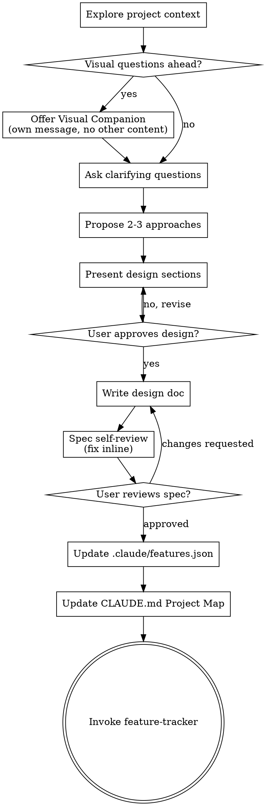

# Brainstorming Ideas Into Designs

Help turn ideas into fully formed designs and specs through natural collaborative dialogue.

Start by understanding the current project context, then ask questions one at a time to refine the idea. Once you understand what you're building, present the design and get user approval.

<HARD-GATE>
Do NOT invoke any implementation skill, write any code, scaffold any project, or take any implementation action until you have presented a design and the user has approved it. This applies to EVERY project regardless of perceived simplicity.
</HARD-GATE>

## Anti-Pattern: "This Is Too Simple To Need A Design"

Every project goes through this process. A todo list, a single-function utility, a config change — all of them. "Simple" projects are where unexamined assumptions cause the most wasted work. The design can be short (a few sentences for truly simple projects), but you MUST present it and get approval.

## Checklist

You MUST create a task for each of these items and complete them in order:

1. **Explore project context** — check files, docs, recent commits. If `PROPOSAL.md` exists, read it first as the primary input for understanding what this project is about.
2. **Offer visual companion** (if topic will involve visual questions) — this is its own message, not combined with a clarifying question. See the Visual Companion section below.
3. **Ask clarifying questions** — one at a time, understand purpose/constraints/success criteria. **MUST include architecture type question** (see Architecture Type Gate below).
4. **Propose 2-3 approaches** — with trade-offs and your recommendation
5. **Present design** — in sections scaled to their complexity, get user approval after each section
6. **Write design doc** — save to `docs/design-docs/YYYY-MM-DD-<topic>-design.md` and commit
7. **Spec self-review** — quick inline check for placeholders, contradictions, ambiguity, scope (see below)
8. **Divergence risk analysis** — identify all non-deterministic components, build risk matrix and divergence trees, append to spec doc (see Divergence Risk Analysis section below)
9. **User reviews written spec** — ask user to review the spec file (including divergence analysis) before proceeding
10. **Update feature list** — extract features from the approved design into `.claude/features.json` (see Feature List section below)
11. **Update project map** — add the new spec and features.json to CLAUDE.md's Project Map (see Project Map Update section below)
12. **Start implementation** — invoke `sp-harness:feature-tracker` to begin feature development.

## Process Flow



**The terminal state is invoking feature-tracker.** Do NOT invoke writing-plans, frontend-design, mcp-builder, or any other implementation skill directly. Brainstorming ends by handing off to feature-tracker, which handles the full implementation cycle.

## The Process

**Understanding the idea:**

- If `PROPOSAL.md` exists in the project root, read it first. This is the user's
  project vision and serves as the primary input for brainstorming. Use it to
  inform your questions and proposals rather than starting from scratch.
- Check out the current project state (files, docs, recent commits)
- Before asking detailed questions, assess scope: if the request describes multiple independent subsystems (e.g., "build a platform with chat, file storage, billing, and analytics"), flag this immediately. Don't spend questions refining details of a project that needs to be decomposed first.
- If the project is too large for a single spec, help the user decompose into sub-projects: what are the independent pieces, how do they relate, what order should they be built? Then brainstorm the first sub-project through the normal design flow. Each sub-project gets its own spec → plan → implementation cycle.
- **Architecture type (MUST ASK):** Before diving into feature details, ask:
  > "What execution architecture does this system use? (a) Pure code — all logic is deterministic code, (b) Pure agent — agent handles end-to-end, code is just tooling, (c) Hybrid — some logic is code, some is agent decisions"
  - If answer is *pure-code* → continue normally, no extra steps.
  - If answer is *pure-agent* or *hybrid* → ask the agent implementation question (see below), then continue.
  - If answer is *hybrid* → ALSO ask the 4 boundary questions (see Hybrid Boundary section below).
- **Agent implementation (only if pure-agent or hybrid):** After architecture type, ask:
  > "How should the agent components be implemented? (a) Blank session — agent starts fresh each time, no persistent definition, (b) CC subagent — defined as `.claude/agents/` files with frontmatter (model, tools, memory, isolation)"
  - If *blank session* → note in spec: "Agent components start from blank session each run." No further questions.
  - If *CC subagent* → for EACH agent role identified in the design, ask these 4 questions to build the frontmatter:
    1. "What tools does this agent need?" (read-only / all / specific list)
    2. "What model?" (opus / sonnet / haiku / inherit)
    3. "Does it need cross-session memory?" (none / project / user / local)
    4. "Does it need an isolated worktree?" (yes / no)
  - Record answers in the spec's `## Agent Definitions` section (see below).
- For appropriately-scoped projects, ask questions one at a time to refine the idea
- Prefer multiple choice questions when possible, but open-ended is fine too
- Only one question per message - if a topic needs more exploration, break it into multiple questions
- Focus on understanding: purpose, constraints, success criteria

**Exploring approaches:**

- Propose 2-3 different approaches with trade-offs
- Present options conversationally with your recommendation and reasoning
- Lead with your recommended option and explain why

**Presenting the design:**

- Once you believe you understand what you're building, present the design
- Scale each section to its complexity: a few sentences if straightforward, up to 200-300 words if nuanced
- Ask after each section whether it looks right so far
- Cover: architecture, components, data flow, error handling, testing
- Be ready to go back and clarify if something doesn't make sense

**Design for isolation and clarity:**

- Break the system into smaller units that each have one clear purpose, communicate through well-defined interfaces, and can be understood and tested independently
- For each unit, you should be able to answer: what does it do, how do you use it, and what does it depend on?
- Can someone understand what a unit does without reading its internals? Can you change the internals without breaking consumers? If not, the boundaries need work.
- Smaller, well-bounded units are also easier for you to work with - you reason better about code you can hold in context at once, and your edits are more reliable when files are focused. When a file grows large, that's often a signal that it's doing too much.

**Working in existing codebases:**

- Explore the current structure before proposing changes. Follow existing patterns.
- Where existing code has problems that affect the work (e.g., a file that's grown too large, unclear boundaries, tangled responsibilities), include targeted improvements as part of the design - the way a good developer improves code they're working in.
- Don't propose unrelated refactoring. Stay focused on what serves the current goal.

## After the Design

**Documentation:**

- Write the validated design (spec) to `docs/design-docs/YYYY-MM-DD-<topic>-design.md`
  - (User preferences for spec location override this default)
- Use elements-of-style:writing-clearly-and-concisely skill if available
- Commit the design document to git

**Spec Self-Review:**
After writing the spec document, look at it with fresh eyes:

1. **Placeholder scan:** Any "TBD", "TODO", incomplete sections, or vague requirements? Fix them.
2. **Internal consistency:** Do any sections contradict each other? Does the architecture match the feature descriptions?
3. **Scope check:** Is this focused enough for a single implementation plan, or does it need decomposition?
4. **Ambiguity check:** Could any requirement be interpreted two different ways? If so, pick one and make it explicit.

Fix any issues inline. No need to re-review — just fix and move on.

**Divergence Risk Analysis:**

After the spec self-review, analyze every component in the design for divergence
risk. Append a `## Divergence Risk Analysis` section to the spec document.

**Step 1: Identify divergence sources.**

Scan the design for any component whose output is non-deterministic. Common sources:

| Source type | Examples |
|-------------|----------|
| LLM calls | Prompt → response, embedding generation, classification |
| Network / external APIs | HTTP requests, third-party services, webhooks |
| User input | Forms, natural language, file uploads |
| Concurrency / timing | Async operations, race conditions, event ordering |
| State dependencies | File system, database, cache, environment variables |

List every divergence source found in the design. If none exist (pure deterministic
system), note that explicitly and skip the remaining steps.

**Step 2: Build risk matrix.**

For each divergence source, assess:
- **Probability**: how likely is divergent behavior? (low / medium / high)
- **Impact scope**: if it diverges, what breaks? (local = single component / chain = downstream cascade / global = system-level failure)

```
              Impact scope
  global  │  medium  │  high    │  critical
  chain   │  low     │  medium  │  high
  local   │  low     │  low     │  medium
          └──────────┴──────────┴──────────
             low       medium     high
                   Probability
```

**Step 3: Build divergence trees for medium/high/critical risks.**

For each risk rated medium or above, trace the propagation path:

```
[Divergence source] → [immediate effect] → [downstream effect] → [user-visible impact]
```

Example:
```
LLM returns malformed JSON
  → parser throws exception
    → API handler returns 500
      → frontend shows error screen
```

These trees directly inform where fallback logic must be inserted during
implementation planning.

**Step 4: Append to spec document.**

Add the complete analysis (sources table, risk matrix, divergence trees) as the
final section of the spec document. This becomes input for the Planner in three-agent-development
which will design fallback chains for each identified risk.

**Hybrid Boundary (only if architecture type = hybrid):**

If the user identified a hybrid architecture in Step 3, append a `## Hybrid Boundary` section to the spec document. Ask these 4 questions during Step 3 (after the architecture type question), then write the answers into the spec:

1. **Component ownership** — which components are deterministic code, which are agent? List each.
2. **Interface contract** — how do code and agent communicate? (JSON files / function calls / stdin-stdout / API). Define the schema.
3. **Orchestrator** — who controls the flow? (code calls agent / agent calls code / external orchestrator). Pick one. If unclear, that is the first design problem to solve.
4. **Failure asymmetry** — agent failure ≠ code failure. When the agent fails, does code retry, degrade, or stop? Define per-interface.

**Rules:**
- If the user answered *pure-code*, this section does NOT exist in the spec. Zero overhead.
- If the user answered *pure-agent*, this section does NOT exist — but `## Agent Definitions` may.
- Do NOT add this section speculatively. Only add it when the user explicitly chose *hybrid*.
- Downstream skills (writing-plans, evaluator) detect this section's presence to activate hybrid-aware logic.

**Agent Definitions (only if pure-agent or hybrid AND user chose CC subagent):**

If the user chose CC subagent implementation, append a `## Agent Definitions` section to the spec document. For each agent role, include the frontmatter built from the Q&A:

```markdown
## Agent Definitions

### {agent-role-name}
- **purpose**: {one-line description}
- **model**: {opus | sonnet | haiku | inherit}
- **tools**: {tool list or "all"}
- **memory**: {none | project | user | local}
- **isolation**: {worktree | none}
- **skills**: {list of sp-harness skills to preload, if any}
```

**Rules:**
- Do NOT pre-fill agent definitions. Every field comes from user answers.
- If user chose *blank session*, this section does NOT exist.
- If user chose *pure-code*, this section does NOT exist.
- writing-plans detects this section and generates `.claude/agents/{name}.md` creation tasks.

**User Review Gate:**
After the spec review loop passes, ask the user to review the written spec before proceeding:

> "Spec written and committed to `<path>`. Please review it and let me know if you want to make any changes before we start writing out the implementation plan."

Wait for the user's response. If they request changes, make them and re-run the spec review loop. Only proceed once the user approves.

## Feature List

After the user approves the spec, extract discrete features into `.claude/features.json`.

**If `.claude/features.json` does not exist**, create it with this top-level structure:

```json
{
  "features": [...]
}
```

**If it exists**, append new features to the `features` array — do not overwrite existing entries.

Each feature follows this structure:

```json
{
  "id": "short-kebab-case-id",
  "category": "functional|ui|infrastructure|testing",
  "priority": "high|medium|low",
  "description": "One-line description of what this feature does",
  "steps": [
    "Implementation step or verification criterion",
    "Another step"
  ],
  "passes": false
}
```

**Rules:**
- `id` must be unique across the file
- `steps` serve as both implementation guidance and verification criteria
- `priority` reflects implementation order: high features should be done first (foundations, core functionality), low features are nice-to-haves
- Set `passes: false` for all new features — feature-tracker skill handles verification and updating
- One feature per testable behavior — if a feature has two independent parts, split it
- Commit the updated features.json alongside the design doc

**Decomposition guideline:** A feature should be completable in a single session. If a feature feels too large, break it into sub-features.

## Project Map Update

After updating features.json, update the `## Project Map` section in `CLAUDE.md`
to reference the new artifacts. This keeps the map current so new sessions can
navigate the project.

**What to update:**
- Add the new spec file to the Docs index (if not already listed)
- Add `.claude/features.json` to the Docs index (if not already listed)
- If the spec introduces new directories or components, add them to the Structure section

**Rules:**
- Do not rewrite the entire Project Map — only add/update entries for new artifacts
- Keep entries to one line each
- Commit the CLAUDE.md update together with the spec and features.json

## Key Principles

- **One question at a time** - Don't overwhelm with multiple questions
- **Multiple choice preferred** - Easier to answer than open-ended when possible
- **YAGNI ruthlessly** - Remove unnecessary features from all designs
- **Explore alternatives** - Always propose 2-3 approaches before settling
- **Incremental validation** - Present design, get approval before moving on
- **Be flexible** - Go back and clarify when something doesn't make sense

## Visual Companion

A browser-based companion for showing mockups, diagrams, and visual options during brainstorming. Available as a tool — not a mode. Accepting the companion means it's available for questions that benefit from visual treatment; it does NOT mean every question goes through the browser.

**Offering the companion:** When you anticipate that upcoming questions will involve visual content (mockups, layouts, diagrams), offer it once for consent:
> "Some of what we're working on might be easier to explain if I can show it to you in a web browser. I can put together mockups, diagrams, comparisons, and other visuals as we go. This feature is still new and can be token-intensive. Want to try it? (Requires opening a local URL)"

**This offer MUST be its own message.** Do not combine it with clarifying questions, context summaries, or any other content. The message should contain ONLY the offer above and nothing else. Wait for the user's response before continuing. If they decline, proceed with text-only brainstorming.

**Per-question decision:** Even after the user accepts, decide FOR EACH QUESTION whether to use the browser or the terminal. The test: **would the user understand this better by seeing it than reading it?**

- **Use the browser** for content that IS visual — mockups, wireframes, layout comparisons, architecture diagrams, side-by-side visual designs
- **Use the terminal** for content that is text — requirements questions, conceptual choices, tradeoff lists, A/B/C/D text options, scope decisions

A question about a UI topic is not automatically a visual question. "What does personality mean in this context?" is a conceptual question — use the terminal. "Which wizard layout works better?" is a visual question — use the browser.

If they agree to the companion, read the detailed guide before proceeding:
`skills/brainstorming/visual-companion.md`
