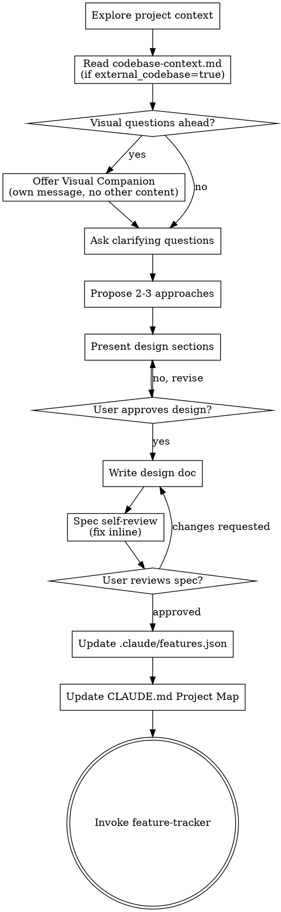

# Brainstorming Ideas Into Designs

Help turn ideas into fully formed designs and specs through natural collaborative dialogue.

Start by understanding the current project context, then ask questions one at a time to refine the idea. Once you understand what you're building, present the design and get user approval.

<HARD-GATE>
Do NOT invoke any implementation skill, write any code, scaffold any project, or take any implementation action until you have presented a design and the user has approved it. This applies to EVERY project regardless of perceived simplicity.
</HARD-GATE>

## Anti-Pattern: "This Is Too Simple To Need A Design"

Every project goes through this process. A todo list, a single-function utility, a config change — all of them. "Simple" projects are where unexamined assumptions cause the most wasted work. The design can be short (a few sentences for truly simple projects), but you MUST present it and get approval.

## Checklist

You MUST create a task for each of these items and complete them in order:

0. **Check todo backlog** — read `.claude/todos.json`. If pending todos exist, list them to the user and ask: "Start from one of these, or new idea?". If user picks a todo, invoke `sp-harness:manage-todos` to mark it `in_brainstorm` and use its description+notes as the seed for the discussion. If user opts for a new idea, proceed normally (may add new todos during brainstorming).
1. **Explore project context** — check files, docs, recent commits. If `PROPOSAL.md` exists, read it first as the primary input for understanding what this project is about. If `.claude/sp-harness.json` has `external_codebase: true`, also read `.claude/codebase-context.md` for the pre-sp-harness code structure (no re-scan needed; that file is the cached understanding from init-project).
2. **Offer visual companion** (if topic will involve visual questions) — this is its own message, not combined with a clarifying question. See the Visual Companion section below.
3. **Ask clarifying questions** — one at a time, understand purpose/constraints/success criteria. **MUST include architecture type question** (see Architecture Type Gate below).
4. **Propose 2-3 approaches** — with trade-offs and your recommendation
5. **Present design** — in sections scaled to their complexity, get user approval after each section
6. **Write design doc** — save to `docs/design-docs/YYYY-MM-DD-<topic>-design.md` and commit
7. **Spec self-review** — quick inline check for placeholders, contradictions, ambiguity, scope (see below)
8. **Divergence risk analysis** — identify all non-deterministic components, build risk matrix and divergence trees, append to spec doc (see Divergence Risk Analysis section below)
9. **User reviews written spec** — ask user to review the spec file (including divergence analysis) before proceeding
10. **Update feature list** — extract features from the approved design into `.claude/features.json` (see Feature List section below)
11. **Update project map** — add the new spec and features.json to CLAUDE.md's Project Map (see Project Map Update section below)
12. **Start implementation** — invoke `sp-harness:feature-tracker` to begin feature development.

## Process Flow



**The terminal state is invoking feature-tracker.** Do NOT invoke writing-plans, frontend-design, mcp-builder, or any other implementation skill directly. Brainstorming ends by handing off to feature-tracker, which handles the full implementation cycle.

## The Process

**Understanding the idea:**

- If `PROPOSAL.md` exists in the project root, read it first. This is the user's
  project vision and serves as the primary input for brainstorming. Use it to
  inform your questions and proposals rather than starting from scratch.
- Check out the current project state (files, docs, recent commits)

**Codebase context (when external code is present):**

If `.claude/sp-harness.json` has `external_codebase: true`, read
`.claude/codebase-context.md` (saved by init-project's one-time scan).
Use it as ground truth for pre-sp-harness module structure, variants,
and dependencies. Do NOT re-scan the codebase here — the cached
understanding is sufficient. If the user reports the cache is stale,
suggest re-running `init-project`.

If `external_codebase: false` (or the field is absent), skip — design
docs in `docs/design-docs/` are the source of truth for sp-harness-built
features. Don't scan or ask about codebase structure unless the user
brings it up.

**On-demand scan exception:** If during clarifying questions you discover
the design will touch a specific module not covered in codebase-context.md
(or no codebase-context.md exists), do a targeted read of that module
only. Do NOT trigger a full project scan.

**Supersession check (MANDATORY when feature replaces existing code):**

Ask:

> "Will this new feature REPLACE any existing feature / module / code path?
>  (If yes, the old code AND its runtime artifacts need a cleanup plan.
>  This prevents stale code or stale data from polluting the new feature.)"

If yes, fill the **Supersession Plan** section in the spec document:

```markdown
## Supersession Plan

### Superseded: <feature-id or module-name>

**Source files to remove:**
- <path>
- <path>

**Runtime artifacts to handle** (knowledge bases, caches, DB tables, indexes,
model files, config keys, scheduled jobs, etc.):
- <path or key> → DELETE | MIGRATE to <new path> | KEEP (justify)
- ...

**Migration plan** (if any MIGRATE above): <one-paragraph description>

**Verification:**
- grep patterns to confirm no stale references after cleanup
- runtime checks (e.g., "inference pipeline no longer loads old model file")
```

**HARD RULE: runtime artifact paths are MANDATORY.** If the user/agent can't
enumerate them, stop and investigate — the reason you missed them is the
reason the stale-data bug will happen. Common artifact classes to probe:
- Generated data files (`data/`, `storage/`)
- Caches and indexes
- ML model checkpoints / embeddings
- Database migrations or tables
- Config file keys that reference the old module
- Scheduled jobs / cron entries tied to the old code
- Knowledge bases / compiled artifacts

If no supersession → skip this section entirely. Don't add it speculatively.

The confirmed understanding becomes a **design constraint** — all subsequent
design decisions must be consistent with it. Record it in the spec document
as a `## Codebase Context` section.

If the project is empty or has no substantial code, skip this entirely.

- Before asking detailed questions, assess scope: if the request describes multiple independent subsystems (e.g., "build a platform with chat, file storage, billing, and analytics"), flag this immediately. Don't spend questions refining details of a project that needs to be decomposed first.
- If the project is too large for a single spec, help the user decompose into sub-projects: what are the independent pieces, how do they relate, what order should they be built? Then brainstorm the first sub-project through the normal design flow. Each sub-project gets its own spec → plan → implementation cycle.
- **Architecture type (MUST ASK):** Before diving into feature details, ask:
  > "What execution architecture does this system use? (a) Pure code — all logic is deterministic code, (b) Pure agent — agent handles end-to-end, code is just tooling, (c) Hybrid — some logic is code, some is agent decisions"
  - If answer is *pure-code* → continue normally, no extra steps.
  - If answer is *pure-agent* or *hybrid* → ask the agent implementation question (see below), then continue.
  - If answer is *hybrid* → ALSO ask the 4 boundary questions (see Hybrid Boundary section below).
  - If the design has multiple agents/components collaborating → also
    consider raising role separation: is there one orchestrator coordinating
    others, or do they coordinate peer-to-peer? Unclear coordination is a
    common source of race conditions and deadlocks.
- **Agent implementation (only if pure-agent or hybrid):** After architecture type, ask:
  > "How should the agent components be implemented? (a) Blank session — agent starts fresh each time, no persistent definition, (b) CC subagent — defined as `.claude/agents/` files with frontmatter (model, tools, memory, isolation)"
  - If *blank session* → note in spec: "Agent components start from blank session each run." No further questions.
  - If *CC subagent* → for EACH agent role identified in the design, ask these 5 questions to build the frontmatter:
    1. "What tools does this agent need?" (read-only / all / specific list)
    2. "What model?" (opus / sonnet / haiku / inherit)
    3. "Does it need cross-session memory?" (none / project / user / local)
    4. "Does it need an isolated worktree?" (yes / no)
    5. "What does this agent read on every invocation?" (list the specific
       files/state sources; missing this leads to stale cached context)
  - Record answers in the spec's `## Agent Definitions` section (see below).
- For appropriately-scoped projects, ask questions one at a time to refine the idea
- Prefer multiple choice questions when possible, but open-ended is fine too
- Only one question per message - if a topic needs more exploration, break it into multiple questions
- Focus on understanding: purpose, constraints, success criteria

**Design-time concerns (consider when applicable, not required):**

These are prompts to raise with the user during clarifying discussion
if the design naturally touches the concern. Skip if the project doesn't
involve the concern, or if the user has already addressed it.

- **State ownership** — if the design evolves toward multiple persistent
  stores (config, data files, caches), consider asking: do any stores
  risk overlapping content? Is each piece of state owned by one source?
  Drift between duplicated stores is a common long-term bug.

- **Knowledge retention** — if the design accumulates knowledge over
  time (learned rules, historical findings, memory of past work), consider
  asking: what's the bar for adding an entry, and how does stale content
  get removed? Bar questions that help: is this non-obvious to the system
  without this memory? Can it be derived from code/spec directly? Was it
  expensive to learn? If any yes, worth keeping. Without explicit rules,
  agent-written knowledge grows unbounded.

- **Automation boundaries** — if the design produces automated actions
  (routing, applying changes, triggering workflows), consider asking:
  which actions are safe to auto-execute vs need user confirmation?
  Actions modifying persistent state or with side effects usually warrant
  explicit user review.

- **Active vs archive** — if the design has work moving through stages
  (in-progress → completed, draft → published, active → historical),
  consider asking: where does "current" state live vs "completed"?
  Conflating the two makes it hard to tell what needs attention. Typical
  pattern: `active/` directory for in-flight, `archive/<id>/` for finished.

- **Audit integrity** — if the design needs traceability (who did what
  when, or why the system produced a given output), consider asking:
  which records should be append-only and never deleted, even if stale?
  Confusing "cleanup" with "audit erasure" removes the ability to
  reconstruct past decisions. Separate ephemeral state from audit logs.

- **Pre-triage vs decided layer** — if the design captures observations
  that later become decisions (bug reports, proposals, ideas), consider
  asking: is there a separation between "observed, not yet decided" and
  "decided to track"? Mixing them means undecided items pollute the
  decided backlog. A staging layer that clears on triage keeps the
  authoritative list clean.

- **Predictive system calibration** — if the design makes predictions,
  classifications, or flags findings that might be wrong, consider asking:
  how will the system know whether its predictions were correct? Without
  a feedback loop, accuracy silently drifts. Simple calibration logs
  (predicted / actual outcome) enable later precision/recall audit.

**Exploring approaches:**

```procedural-instruction
- Propose 2-3 different approaches with trade-offs
- Present options conversationally with your recommendation and reasoning
- Lead with your recommended option and explain why
```

```worked-example
Suppose the user is building a small CLI tool and asked "where should
API keys be stored". Three real options worth considering: a JSON file
under ~/.config/, an encrypted SQLite store, the OS keychain. The
"Exploring approaches" output should look like the following.

I'd start with the OS keychain — `keyring` on Python wraps macOS
Keychain, Windows Credential Manager, and libsecret on Linux behind
one API. Recommendation because it's the only option that gets free
encryption-at-rest, OS-level access prompts on suspicious reads, and
no plaintext secret ever lives in your config dir.

Trade-offs against the alternatives. JSON in `~/.config/<tool>.json`
is dead simple and grep-friendly but also world-readable on
misconfigured systems and silently survives a `cp -r ~ /tmp/backup`
that ends up on Slack. Encrypted SQLite (sqlite-with-SQLCipher) gets
encryption but pushes key management on you — you've just moved the
"where do secrets live" problem one layer down. Keychain-aware tools
also play nicer with corporate MDM and password managers users
already trust.

The trade-off worth surfacing: keychain is harder to inspect when
debugging ("why does my deploy fail" → can't `cat` the secret).
We'd want a `--show-keychain-key` flag for that one case.

Want to go with keychain, or is grep-friendliness the higher
priority for you?

Five things this example does that abstract bullets do not enforce:

1. Leads with the recommended option in the FIRST sentence — not a
   neutral "here are three options" survey.
2. Names the specific implementation hook for the recommendation
   (`keyring` library + which OS API it wraps), not just the
   abstract category ("use the OS keychain").
3. Each alternative gets a concrete failure mode in one sentence
   ("survives `cp -r` that ends up on Slack"), not just a generic
   "less secure".
4. Surfaces a trade-off WITHIN the recommendation ("harder to
   inspect when debugging") rather than pretending the recommended
   option is dominant on every axis.
5. Ends with a focused yes/no question, not an open-ended
   "what do you think". The decision is small enough to land here,
   not loop indefinitely.
```

**Presenting the design:**

```procedural-instruction
- Once you believe you understand what you're building, present the design
- Scale each section to its complexity: a few sentences if straightforward, up to 200-300 words if nuanced
- Ask after each section whether it looks right so far
- Cover: architecture, components, data flow, error handling, testing
- Be ready to go back and clarify if something doesn't make sense
```

```worked-example
Suppose the user wants a URL shortener with admin dashboard. After
clarifying questions you understand: PostgreSQL backend, JWT auth,
rate limiting at one hundred requests per minute per user. The
"Presenting the design" output should look like the following.

Architecture. Single FastAPI service. Two tables: `urls` (slug,
target, owner_id, created_at) and `users` (id, email_hash, pw_hash).
Rate limiter is a Redis sliding window keyed by `owner_id`. Admin
dashboard is a separate FastAPI sub-app mounted under `/admin`,
sharing the same DB pool.

Data flow. Client POST /shorten → handler validates JWT → writes
row to `urls` → returns canonical short URL. Client GET /:slug →
handler reads `urls` by slug → 302 redirect with cache header.

Error handling. Structured exceptions surfaced as RFC 7807 problem
details. Rate-limit breach returns 429 with retry-after; bad JWT
returns 401; missing slug returns 404 (not 410 — slugs are not
recyclable).

Testing. Unit: rate-limit window math. Integration: full POST/GET
round-trip under load. Adversarial: collision rate at high volume,
JWT tampering.

Five things this example does that abstract bullets do not enforce:

1. Each section names concrete files and tables, not abstract roles
   such as "the API layer" or "the storage tier".
2. The rate-limiter section says HOW it is implemented (Redis
   sliding window) and KEYED BY WHAT (`owner_id`). Not just "rate
   limiting".
3. The trade-off lives in the choice (Redis vs in-process), not in
   whether to have rate limiting at all.
4. Error handling commits to specific status codes and a specific
   format (RFC 7807). Not just "structured exceptions".
5. Testing names test categories (unit / integration / adversarial)
   plus what each verifies. Not just "covers happy path and edge
   cases".
```

**Design for isolation and clarity:**

- Break the system into smaller units that each have one clear purpose, communicate through well-defined interfaces, and can be understood and tested independently
- For each unit, you should be able to answer: what does it do, how do you use it, and what does it depend on?
- Can someone understand what a unit does without reading its internals? Can you change the internals without breaking consumers? If not, the boundaries need work.
- Smaller, well-bounded units are also easier for you to work with - you reason better about code you can hold in context at once, and your edits are more reliable when files are focused. When a file grows large, that's often a signal that it's doing too much.

**Working in existing codebases:**

- Explore the current structure before proposing changes. Follow existing patterns.
- Where existing code has problems that affect the work (e.g., a file that's grown too large, unclear boundaries, tangled responsibilities), include targeted improvements as part of the design - the way a good developer improves code they're working in.
- Don't propose unrelated refactoring. Stay focused on what serves the current goal.

## After the Design

**Documentation:**

- Write the validated design (spec) to `docs/design-docs/YYYY-MM-DD-<topic>-design.md`
  - (User preferences for spec location override this default)
- Use elements-of-style:writing-clearly-and-concisely skill if available
- Commit the design document to git

**Spec Self-Review:**
After writing the spec document, look at it with fresh eyes:

1. **Placeholder scan:** Any "TBD", "TODO", incomplete sections, or vague requirements? Fix them.
2. **Internal consistency:** Do any sections contradict each other? Does the architecture match the feature descriptions?
3. **Scope check:** Is this focused enough for a single implementation plan, or does it need decomposition?
4. **Ambiguity check:** Could any requirement be interpreted two different ways? If so, pick one and make it explicit.

Fix any issues inline. No need to re-review — just fix and move on.

**Divergence Risk Analysis:**

After the spec self-review, analyze every component in the design for divergence
risk. Append a `## Divergence Risk Analysis` section to the spec document.

**Step 1: Identify divergence sources.**

Scan the design for any component whose output is non-deterministic. Common sources:

| Source type | Examples |
|-------------|----------|
| LLM calls | Prompt → response, embedding generation, classification |
| Network / external APIs | HTTP requests, third-party services, webhooks |
| User input | Forms, natural language, file uploads |
| Concurrency / timing | Async operations, race conditions, event ordering |
| State dependencies | File system, database, cache, environment variables |

List every divergence source found in the design. If none exist (pure deterministic
system), note that explicitly and skip the remaining steps.

**Step 2: Build risk matrix.**

For each divergence source, assess:
- **Probability**: how likely is divergent behavior? (low / medium / high)
- **Impact scope**: if it diverges, what breaks? (local = single component / chain = downstream cascade / global = system-level failure)

```
              Impact scope
  global  │  medium  │  high    │  critical
  chain   │  low     │  medium  │  high
  local   │  low     │  low     │  medium
          └──────────┴──────────┴──────────
             low       medium     high
                   Probability
```

**Step 3: Build divergence trees for medium/high/critical risks.**

For each risk rated medium or above, trace the propagation path:

```
[Divergence source] → [immediate effect] → [downstream effect] → [user-visible impact]
```

Example:
```
LLM returns malformed JSON
  → parser throws exception
    → API handler returns 500
      → frontend shows error screen
```

These trees directly inform where fallback logic must be inserted during
implementation planning.

**Step 4: Append to spec document.**

Add the complete analysis (sources table, risk matrix, divergence trees) as the
final section of the spec document. This becomes input for the Planner in three-agent-development
which will design fallback chains for each identified risk.

**Hybrid Boundary (only if architecture type = hybrid):**

If the user identified a hybrid architecture in Step 3, append a `## Hybrid Boundary` section to the spec document. Ask these 4 questions during Step 3 (after the architecture type question), then write the answers into the spec:

1. **Component ownership** — which components are deterministic code, which are agent? List each.
2. **Interface contract** — how do code and agent communicate? (JSON files / function calls / stdin-stdout / API). Define the schema.
3. **Orchestrator** — who controls the flow? (code calls agent / agent calls code / external orchestrator). Pick one. If unclear, that is the first design problem to solve.
4. **Failure asymmetry** — agent failure ≠ code failure. When the agent fails, does code retry, degrade, or stop? Define per-interface.

**Rules:**
- If the user answered *pure-code*, this section does NOT exist in the spec. Zero overhead.
- If the user answered *pure-agent*, this section does NOT exist — but `## Agent Definitions` may.
- Do NOT add this section speculatively. Only add it when the user explicitly chose *hybrid*.
- Downstream skills (writing-plans, evaluator) detect this section's presence to activate hybrid-aware logic.

**Agent Definitions (only if pure-agent or hybrid AND user chose CC subagent):**

If the user chose CC subagent implementation, append a `## Agent Definitions` section to the spec document. For each agent role, include the frontmatter built from the Q&A:

```markdown
## Agent Definitions

### {agent-role-name}
- **purpose**: {one-line description}
- **model**: {opus | sonnet | haiku | inherit}
- **tools**: {tool list or "all"}
- **memory**: {none | project | user | local}
- **isolation**: {worktree | none}
- **skills**: {list of sp-harness skills to preload, if any}
```

**Rules:**
- Do NOT pre-fill agent definitions. Every field comes from user answers.
- If user chose *blank session*, this section does NOT exist.
- If user chose *pure-code*, this section does NOT exist.
- writing-plans detects this section and generates `.claude/agents/{name}.md` creation tasks.

**User Review Gate — Decision brief (NOT "please read the spec"):**

After the spec review loop passes, DO NOT ask the user to open and read
the spec file. The spec is for future-session agents (Planner); the user
reviews a condensed terminal brief instead.

The `→ Your call` block is a decision touch-point per
`${CLAUDE_PLUGIN_ROOT}/docs/decision-touchpoint-protocol.md`. Each ⚠️
line in `Key decisions made` marks an open question the spec could not
resolve without user input — set ⚠️ only when confidence < 70 or the
spec explicitly deferred the decision.

**Self-check before print:** re-read each gloss in the brief aloud as
if to a colleague unfamiliar with the project. If a phrase reads like
jargon ("decision instrumentation framework", "schema invariant
violation"), rewrite it in plain conversational form before emitting.

Print a brief in this exact structure (≤ 30 lines):

```output-template
📐 Design ready: <topic>

Spec saved: <spec path>

Problem:
  <1-2 sentences, natural language, paraphrased — NOT copied from
  user's original wording>

Approach:
  <1-2 sentences describing the chosen approach at a high level>

Key decisions made:
  · D1(<short summary, conversational, ≤12 words, no jargon —
        e.g. "Should usernames be case-sensitive?">) → <choice> (<confidence>%)
  · D2(<short summary>) → <choice> (<confidence>%)
  ⚠️ D3(<short question>) — needs your call (<confidence>%)
  ...

Divergence risks:
  <1-3 line summary of the biggest non-deterministic risks from the
   Divergence Risk Analysis section, in plain prose>

Scope:
  <N> features will be extracted · <files/modules touched or created>

→ Your call:
  [IF any ⚠️ open — restate the lowest-confidence question first]
    <plain-language question, restated>:
      Background: <code/behavior state that triggered this — describe
                   the situation, not the spec section>
      What it controls: <observable behavior change>
      My pick: (<x>) <option> — <reason>, <confidence>%
      Options:
        (a) <one-sentence consequence in plain language>
        (b) <one-sentence consequence in plain language>
        (c) <one-sentence consequence in plain language>
  [IF all resolved]
    (a) Approve and continue — features get extracted into features.json,
        then feature-tracker starts on the highest-priority one.
    (b) Edit the spec — tell me what to change before we extract anything.
    (c) Discard — cancel this brainstorm; nothing is written to the
        feature list.
```

Rules:
- NEVER say "please review the spec file." The user reads only the brief.
- If the user wants to see the spec, they open the file themselves. The
  brief is the authoritative review artifact.
- If multiple ⚠️ open decisions exist, ask them one at a time (ask the
  one with lowest confidence first). Do not bundle open decisions.
- When the user picks an option or approves, update the spec file
  accordingly BEFORE moving to feature extraction.
- Every ⚠️ ask follows the decision-touchpoint protocol referenced above:
  Background / What it controls / My pick / Options must be present;
  every codename (`D1`, `D2`, ...) must lead its line followed by an
  inline plain-language gloss in parens (canonical form
  `D1(<gloss>) → <choice>`); option lines must be one-sentence
  consequences, never just labels like `Option B`.

**Before printing the brief, write an in-flight topic block to the
`## Buffer` section of `.claude/memory.md`.** This lets a later session
auto-resume if the user pauses. Use this schema:

```markdown
### <topic-id>  (paused: <ISO 8601 UTC>)
- **Phase**: brainstorm post-spec-draft, awaiting user review
- **Context**: <1-2 sentences on what the spec covers and any significant
  mid-process pivots>
- **Open**: <any open questions or alternatives still to be decided>
- **Pointers**:
  - <spec path>
  - todo: <linked-todo-id if any>
- **Next**: Resolve open questions (if any), finalize spec, extract features
  via manage-features, dispatch feature-tracker.
```

Write the block BEFORE printing the brief — so even if the user
closes the session without replying, next session can resume.

Once the user approves and you move on (extract features, dispatch
feature-tracker), **remove** this in-flight block. The brainstorm is no
longer in-flight after handoff.

Write in-flight content in the same language as the surrounding spec
and conversation — consistency matters more than any fixed language
policy at the project level.

## Feature List

After the user approves the spec, extract discrete features using
`sp-harness:manage-features`. **Do NOT hand-write the JSON file.** For
each feature, invoke:

```bash
python3 "${CLAUDE_PLUGIN_ROOT}/skills/manage-features/scripts/mutate.py" add \
  --id=kebab-case-id \
  --display-name="Short noun phrase" \
  --category=functional|ui|infrastructure|testing \
  --priority=high|medium|low \
  --description="One-line description" \
  --steps="step 1;;step 2;;step 3" \
  [--depends-on=id1,id2] \
  [--supersedes=old-feature-id,another-old-id] \
  [--from-todo=<todo-id>]
```

Steps are separated by `;;` (double semicolon). The script validates
schema, dependency references, supersedes references, and rejects cycles on every add.

**Rules:**
- `id` must be unique (script enforces)
- `display_name` is a 3-6 word **noun phrase** (≤ 60 chars) describing what
  the feature IS, not a verb phrase for what you do. Derive it per feature
  from spec context — do not fall back to the heuristic auto-derivation.
  Example: ✅ `"Skill routing audit harness"` · ❌ `"Build audit harness for routing"`
- `depends_on` only references features already added (add in dependency order)
- `supersedes` references features this one replaces — set if the spec has
  a `## Supersession Plan` section. Listed feature ids must exist in features.json.
- `from_todo` is the id from Step 0's selected todo, if any.
- `steps` serve as both implementation guidance and verification criteria
- `priority` is a tiebreaker within the same dependency layer
- All new features start with `passes: false` (script default)
- One feature per testable behavior — if a feature has two independent parts, split it
- Commit the updated features.json alongside the design doc

**Decomposition guideline:** A feature should be completable in a single session. If a feature feels too large, break it into sub-features.

**Link features back to todo:** If this brainstorming session started from
a todo (Step 0), after adding all features invoke:

```bash
python3 "${CLAUDE_PLUGIN_ROOT}/skills/manage-todos/scripts/mutate.py" \
  link-features <todo-id> <feat-id-1> <feat-id-2> ...
```

This transitions the todo's status to `in_feature` and records the linkage.

## Project Map Update

After updating features.json, update the `## Project Map` section in `CLAUDE.md`
to reference the new artifacts. This keeps the map current so new sessions can
navigate the project.

**What to update:**
- Add the new spec file to the Docs index (if not already listed)
- Add `.claude/features.json` to the Docs index (if not already listed)
- If the spec introduces new directories or components, add them to the Structure section

**Rules:**
- Do not rewrite the entire Project Map — only add/update entries for new artifacts
- Keep entries to one line each
- Commit the CLAUDE.md update together with the spec and features.json

## Key Principles

- **One question at a time** - Don't overwhelm with multiple questions
- **Multiple choice preferred** - Easier to answer than open-ended when possible
- **YAGNI ruthlessly** - Remove unnecessary features from all designs
- **Explore alternatives** - Always propose 2-3 approaches before settling
- **Incremental validation** - Present design, get approval before moving on
- **Be flexible** - Go back and clarify when something doesn't make sense

## Visual Companion

A browser-based companion for showing mockups, diagrams, and visual options during brainstorming. Available as a tool — not a mode. Accepting the companion means it's available for questions that benefit from visual treatment; it does NOT mean every question goes through the browser.

**Offering the companion:** When you anticipate that upcoming questions will involve visual content (mockups, layouts, diagrams), offer it once for consent:
> "Some of what we're working on might be easier to explain if I can show it to you in a web browser. I can put together mockups, diagrams, comparisons, and other visuals as we go. This feature is still new and can be token-intensive. Want to try it? (Requires opening a local URL)"

**This offer MUST be its own message.** Do not combine it with clarifying questions, context summaries, or any other content. The message should contain ONLY the offer above and nothing else. Wait for the user's response before continuing. If they decline, proceed with text-only brainstorming.

**Per-question decision:** Even after the user accepts, decide FOR EACH QUESTION whether to use the browser or the terminal. The test: **would the user understand this better by seeing it than reading it?**

- **Use the browser** for content that IS visual — mockups, wireframes, layout comparisons, architecture diagrams, side-by-side visual designs
- **Use the terminal** for content that is text — requirements questions, conceptual choices, tradeoff lists, A/B/C/D text options, scope decisions

A question about a UI topic is not automatically a visual question. "What does personality mean in this context?" is a conceptual question — use the terminal. "Which wizard layout works better?" is a visual question — use the browser.

If they agree to the companion, read the detailed guide before proceeding:
`skills/brainstorming/visual-companion.md`
